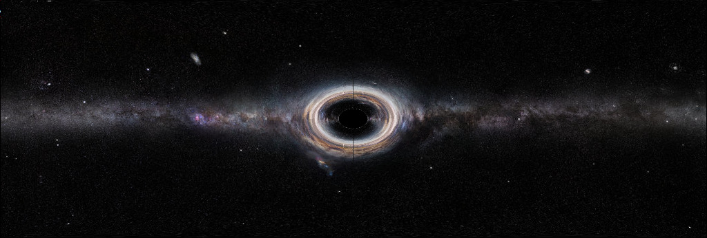

# Installation

Just run the following code in the REPL to install the package.

```julia
using Pkg
Pkg.add("https://github.com/inokawazu/SchwarzschildGeo.jl")
```

# Example

```julia
using SchwarzschildGeo
schview() #uses the default picture
```

The output will be an array of RGBs. You can save the output with `save`.

# Usage

```julia
using SchwarzschildGeo
schview("<pathtoimagefile>"; r0=<number greater than one>) 
#use your own image file with a different r0 which is the radial position
#of the camera.
```

As with the example the output will be an array of RGBs. 
You can save the output with `save`. 
`r0` needs to be greater that one because the horizon is located at $r=1$.
